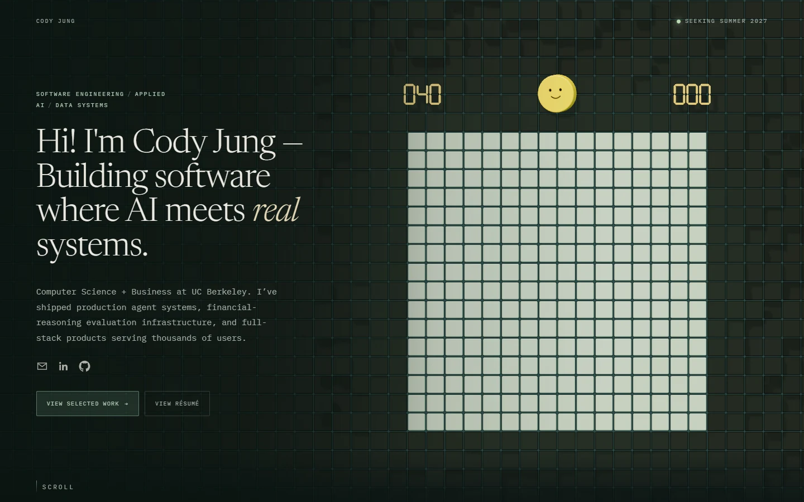
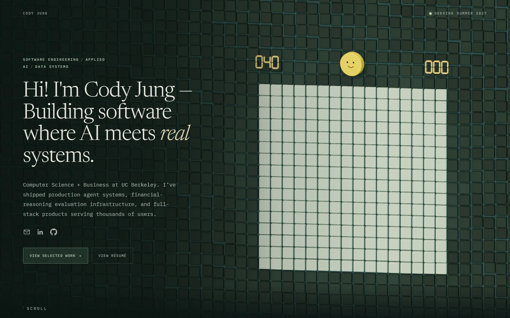
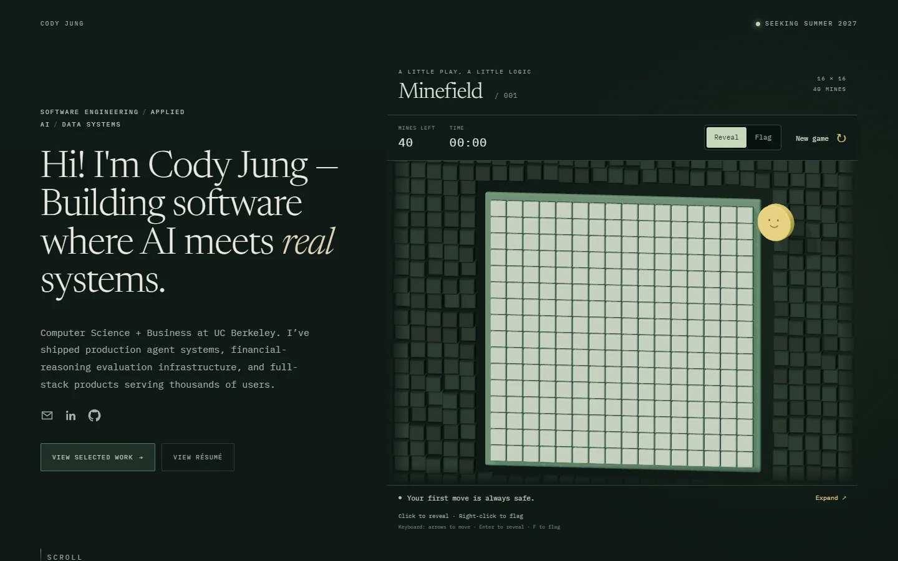
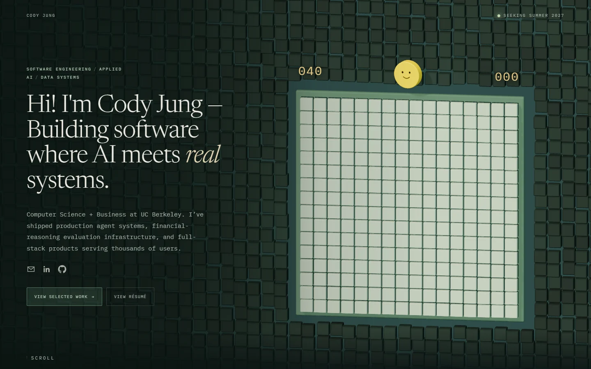

# Full-header Minesweeper review

The scene now spans the entire hero, with an enlarged playable board on the right. The toolbar, title, dimensions, mode toggle, text instructions, expanded view and separate reset button are gone. The only visible game interface is the two floating numerical counters and the classic yellow smiley disc. The disc is also the keyboard-accessible reset target.

## Frontal camera, darker wall and hover glow

The counters now have 0.24-unit extrusion (previously 0.16). The camera starts straight-on at zero horizontal/vertical offset. Pointer travel reaches 2.5 units on both axes, with easing and the existing board-interaction camera hold. Native scroll still adds its modest viewpoint change.

Background caps are darker forest green and 0.97 units wide on the shared one-unit lattice (previously 0.91), leaving smaller gaps. Recessed depth variation is stronger, with matching surface height retained beside the board. Simple box shadow proxies preserve relief shadows without duplicating the bevel geometry in the shadow pass. Hover lift increases from 0.24 to 0.48 units. Soft sage light sits beneath raised background caps; its shader explicitly masks out the playable board. Reduced motion disables this hover movement and glow.

[Background hover glow](wall-glow.webp), [board hover](wall-board-hover.webp), [mobile](wall-mobile.webp), [left](wall-left.webp), [right](wall-right.webp), [up](wall-up.webp), [down](wall-down.webp).

[Camera and browser measurements](wall-check.json) confirm initial offset `[0, 0]`, more than two units of response in each direction after easing, working reveal input, reduced-motion rendering, and no browser or shader errors. Screenshots use the same 1440×900 desktop viewport. Lint, type checks, and the production build pass.

## Earlier border, counter and gaze refinement

The playing field now shares the surrounding voxel lattice without a frame, backing slab, or empty perimeter. Edge voxels match the board depth; relief gradually returns farther away. Counters are actual beveled 3D seven-segment numerals, with a shared instanced mesh and no font download. Eye tracking uses the disc as its origin and has a larger, bounded range.

[Partially revealed](seamless-play.webp), [mobile](seamless-mobile.webp), [left/right gaze comparison](gaze-comparison.webp). Browser checks confirmed counter changes on flags, elapsed time, and reset, including redraws with reduced motion enabled. No page errors were recorded. Lint, type checks, and the production build pass. A production smoke test also passed two-finger pan, offscreen pausing, and HTML fallback checks.

The captures below document the preceding full-header revision. The performance section is updated for the current scene.

## Visual evidence

The earlier panel composition and the revised full-header composition were captured at 1440×900:

| Earlier composition | Revised composition |
| --- | --- |
|  |  |

[Flagged opening](full-flagged.webp), [explosion wave](full-wave.webp), [loss](full-loss.webp), [victory](full-win.webp), [mobile](full-mobile.webp), [HTML fallback](full-fallback.webp), [animation recording](revision-motion.webm).

The recording covers wall hover, reveal, flag placement/removal, explosion, reconstruction, and victory. The wall remains visible behind the introduction with lower contrast. HTML text and links stay fixed during effects.

## Verification

- Eleven pure-rule tests pass: all 256 safe first moves across three seeds, independent counts, flood fill, flags, terminal state/reset, public-information isolation, correct chords, insufficient/excess flags, incorrect-flag loss, and a winning edge chord.
- Browser input checks pass: primary-click chord, simultaneous mouse buttons without a stray reveal/flag, keyboard reveal/flag, and disc reset by pointer and keyboard.
- Pointer parallax and native-scroll viewpoint changes were measured; camera offsets remain unchanged while hovering the board. Decorative wall cells use the same world-space pointer with a softer local spring response.
- Chrome touch emulation passes: long-press flag, tap reveal, two-finger pinch (measured 2.04×), and native one-finger scrolling without an accidental reveal. The board never enters a modal or locks document scrolling. Zoomed geometry and picking are clipped below the counters and inside the play area.
- Reduced motion stops continuous rendering while preserving interaction. Responsive checks at 320px, 390px, 768px, 1440px and 1920px found no document horizontal overflow.
- WebGL-unavailable fallback remains playable and resets through its smiley. Portfolio content and links remain HTML.
- Type checking and the optimized Next.js build pass; the build also runs lint. Development-only game hooks are excluded from production.

Detailed interaction measurements: [revision-validation.json](revision-validation.json). The earlier pipeline audit measured actual 4× MSAA, and separately exercised forced SMAA and RGBA8 paths without errors: [pipeline.json](pipeline.json).

## Rendering and performance

The renderer uses SRGB output and ACES tone mapping. The composer owns anti-aliasing; browser canvas antialiasing is disabled. Highlight bloom strength is 0.1. Desktop DPR is capped at 1.4; narrow-screen DPR is capped at 1.25. A 1.6-million-pixel buffer budget further limits high-DPR and large displays. The full-header wall increases geometry and drawing area, so this revision is measured separately from the earlier panel.

Production measurements are recorded in [performance.json](performance.json). They measure requestAnimationFrame cadence over 180 intervals in sequential Chrome sessions on this Windows host, without CPU/network throttling. Mobile results are desktop-host emulation, not physical-phone benchmarks.

Final production run: Chrome 152.0.7977.84, Windows, AMD Radeon 880M (ANGLE/D3D11).

| Case | Drawing buffer | Mean cadence | p95 frame interval |
| --- | --- | --- | --- |
| desktop | 1440 × 915 | 31.8 FPS | 48.7 ms |
| desktop-dpr2 | 1586 × 1008 | 29.6 FPS | 48.7 ms |
| mobile-emulated | 487 × 1321 | 37.0 FPS | 41.8 ms |

All three cases used measured 4× MSAA, 25 draw calls with keyboard focus visible, and reported no page errors. The scene does not sustain 60 FPS on this host; these short runs also vary with system load. High-DPR rendering remains the most expensive case. Production checks also passed keyboard reveal, disc reset, no-JavaScript content, two-finger pan, offscreen pause, and the WebGL-unavailable fallback.

[Production touch-pan and offscreen-pause checks](production-interaction.json); [zoomed touch view](touch-zoom.webp).

## Reference observations and scope

The original research observed repeated three-dimensional blocks in the live [Oxigen scene](https://www.oxigen.sa/) and a glowing particle field in [The State of the Gallery](https://mesh3d.gallery/the-state-of-the-gallery). Their Awwwards inspiration pages did not reliably load. No specific click-pulse behavior from those pages is claimed as observed; the local wave follows the written brief. The implementation uses installed Three.js r186 directly and shared instanced geometry, following its [InstancedMesh interface](https://threejs.org/docs/pages/InstancedMesh.html).

The abandoned sakura scene, ASCII predecessor, dedicated assets, utilities, scripts and tests have been removed. Shared rendering utilities, portfolio data, résumé and project media remain.

## Remaining limits

Touch behavior has been checked in Chromium emulation; physical iOS/Android devices and assistive-technology software have not been tested. The HTML fallback is intentionally simpler and uses native browser zoom. The time display stops growing at 999 seconds while the underlying elapsed time remains accurate. No sound is included.

